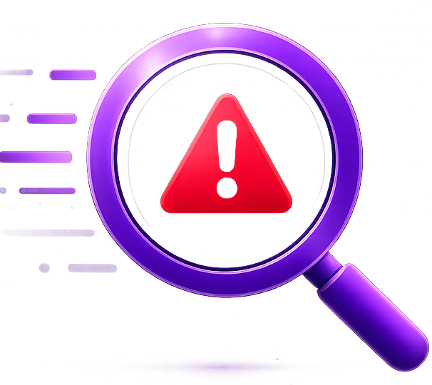

<div align="center">



# 🛡️ ThreatLens

### AI-Powered Scam & Phishing Detection Platform

Analyze URLs, Emails, Messages, and Screenshots using a hybrid AI + Rule-Based detection engine to identify phishing attempts, scams, and malicious content in real time.

---


</div>

---

# 📌 Overview

ThreatLens is an AI-assisted cybersecurity platform designed to detect phishing attacks, online scams, fraudulent messages, suspicious emails, malicious URLs, and deceptive screenshots.

The application combines traditional cybersecurity techniques with modern AI to deliver explainable threat analysis rather than simply classifying content as safe or unsafe.

Instead of relying on a single detection method, ThreatLens integrates rule-based analysis, OCR, computer vision, pattern recognition, and Large Language Models to generate an overall threat assessment with supporting explanations.

Built as a full-stack cybersecurity project, ThreatLens demonstrates practical implementation of phishing detection techniques while providing a modern dashboard experience inspired by commercial security platforms.

---

# ✨ Key Features

## 🌐 URL Analysis

Analyze suspicious links using multiple security checks.

Features include:

* HTTPS verification
* Suspicious keyword detection
* IP-based URL detection
* URL shortening detection
* Login page detection
* Domain pattern analysis
* AI-powered explanation
* Overall risk scoring

---

## 📧 Email Analysis

Identify phishing emails using structural and content-based indicators.

Detection includes:

* Suspicious sender patterns
* Fake banking emails
* Credential harvesting attempts
* Urgent language
* Suspicious attachments
* Display name anomalies
* AI-generated threat explanation

---

## 💬 Message Analysis

Detect common scam messages such as:

* OTP scams
* Lottery scams
* Investment scams
* Job scams
* Delivery scams
* Tech support scams
* Romance scams
* KYC verification scams

Each message receives:

* Threat explanation
* Risk score
* Security recommendation

---

## 🖼 Screenshot Analysis

ThreatLens analyzes screenshots using OCR and computer vision techniques.

Capabilities include:

* OCR text extraction
* Login page detection
* Browser detection
* QR code detection
* Banking interface detection
* Government portal detection
* Payment application recognition
* Screenshot risk assessment

---

## 🤖 AI Threat Explanation

Integrated with Groq LLM to generate:

* Human-readable explanations
* Threat summaries
* Risk reasoning
* Security recommendations

---

## 📊 Hybrid Risk Engine

ThreatLens combines:

* Rule-Based Detection
* Pattern Matching
* OCR Analysis
* Computer Vision
* AI Reasoning

to generate:

* Overall Risk Score
* Threat Level
* Detected Indicators
* Security Recommendation

---

## 📈 Interactive Dashboard

Modern dashboard including:

* Overall Risk Score
* Threat Overview
* AI Explanation Timeline
* Threat Detection Cards
* Security Recommendations
* Analysis History
* Responsive Interface

---

# 🚀 Highlights

* Hybrid Rule-Based + AI Detection
* OCR-Powered Screenshot Analysis
* Explainable AI Responses
* Modular Frontend Architecture
* Flask REST Backend
* Responsive Dashboard
* Multi-Input Threat Detection
* Cybersecurity-Focused Design

---

# 🛠 Technology Stack

## Frontend

* HTML5
* CSS3
* JavaScript (ES6)
---

## Backend

* Python
* Flask
* Flask-CORS
---

## Artificial Intelligence

* Groq API
* Llama Large Language Model
---

## Computer Vision

* OpenCV
* EasyOCR
* Pyzbar
* NumPy
---

## Utilities

* Werkzeug
* Requests
---

# 📂 Project Structure

```text
ThreatLens/
│
├── assets/
├── components/
├── js/
│   ├── config/
│   ├── modules/
│   ├── services/
│   └── utils/
│
├── pages/
├── styles/
├── templates/
├── uploads/
│
├── ai_engine.py
├── risk_engine.py
├── screenshot_checker.py
├── app.py
├── requirements.txt
├── README.md
└── index.html
```

---

# ⚙️ Installation

Clone the repository

```bash
git clone https://github.com/YOUR_USERNAME/ThreatLens.git
```

Move into the project

```bash
cd ThreatLens
```

Create a virtual environment

```bash
python -m venv venv
```

Activate the environment

### Linux / macOS

```bash
source venv/bin/activate
```

### Windows

```bash
venv\Scripts\activate
```

Install dependencies

```bash
pip install -r requirements.txt
```

Run the Flask server

```bash
python app.py
```

Launch the frontend using Live Server or open `index.html`.

---

# 🔑 Environment Variables

Create a `.env` file in the project root.

```env
GROQ_API_KEY=your_api_key_here
```

---

# 🎯 Learning Outcomes

This project demonstrates practical implementation of:

* Cybersecurity Fundamentals
* Phishing Detection
* REST API Development
* OCR Integration
* Computer Vision
* AI-Assisted Security Analysis
* Risk Scoring Systems
* Frontend Architecture
* Flask Backend Development
* Secure Application Design

---

# 🔒 Disclaimer

ThreatLens is developed for educational, research, and cybersecurity awareness purposes.

While the application detects a wide range of phishing indicators and suspicious patterns, it should not be considered a replacement for enterprise-grade security solutions.

---

# 🚀 Future Scope

Potential future enhancements include:

* Browser Extension
* VirusTotal Integration
* PDF Scam Detection
* Cloud-Based Analysis History

---

# 👩‍💻 Author

**Mihika Ahirwar**

B.Tech Computer Science Engineering Student

**Areas of Interest**

* Cybersecurity
* Artificial Intelligence
* Web Security
* Full Stack Development
* UI/UX Design

---

<div align="center">

### Built with Python, Flask, JavaScript, AI, and a passion for Cybersecurity.

</div>
